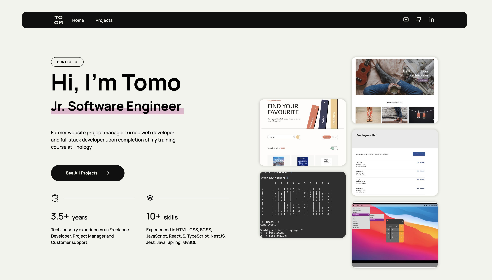

# Portfolio Website

The site is available at https://tomok.dev/

## Project Brief

This project was to revamp my personal portfolio site upon completing a Nology course. The app was developed in ReactJS with TypeScript, and the portfolio data was stored statically and locally in object format. The aim of this revamp was to make my portfolio simpler and easier to navigate so that anyone who visits my site can find information easily.

## Technical Implementation

I have develop this app in ReactJS with TypeScript as I wanted to utilise this opportunity to practice my TypeScript skills. The site was small and simple but I ensured it is responsive for all devices.

**1. Filter function by tag**
On the projects list page, there is a filter/tab function where each tag can be clicked to showcase the filtered projects. This was achieved by passing the filter reference in the onClick handler function and filtering the data with the reference on the parent component. To style the selected tag, I utilized the `data-active` attribute to indicate which item is currently selected so that I can apply different styling from other regular state.

**2. New tools CSS module and TypeScript in ReactJS**
Since I have built apps with SASS modules in the past, I have tried to built this one with CSS module for my additional experience. Also, I have built this with TypeScript, which provides a type safety.

## Refection

- This was a simple and small app where I could reinforce my fundamental skills in ReactJS with TypeScript. When it comes props and TypeScript, it provides me opportunities to carefully consider types and usages (optional or not) and linkages between components, which is great.

- Since this is a static site, I should look into developing the portfolio site in GatsbyJS in the future.
